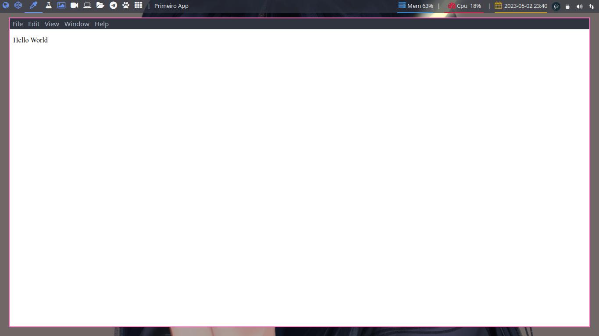

# Meu Primeiro Aplicativo

Criar um aplicativo desktop pode parecer uma tarefa complicada para quem não tem experiência em programação, mas com o electron.js isso se torna mais acessível. O electron.js é uma estrutura de desenvolvimento de aplicativos de desktop de código aberto que permite que os desenvolvedores criem aplicativos multiplataforma usando tecnologias web como HTML, CSS e JavaScript.

Iniciar o Aplicativo

```bash
npm run start
```

## Captura de Tela


